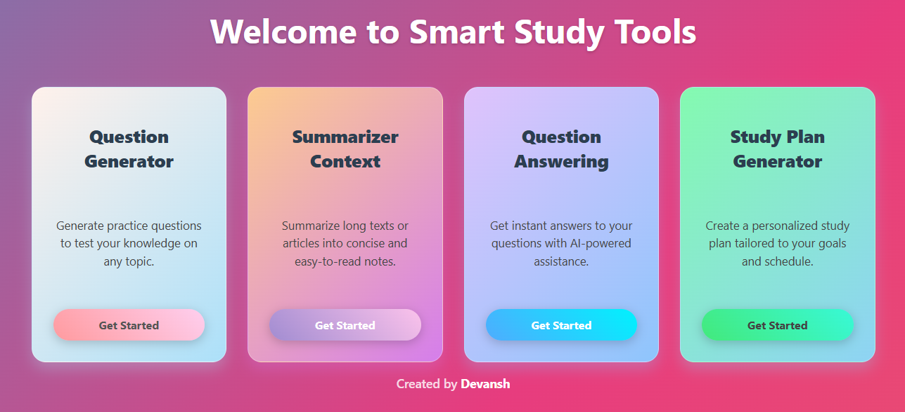
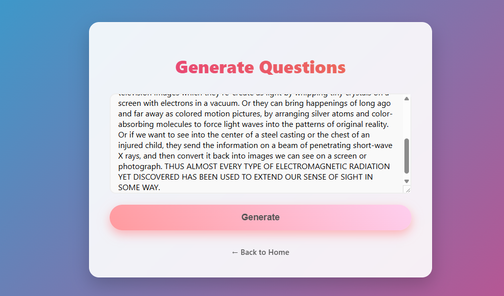
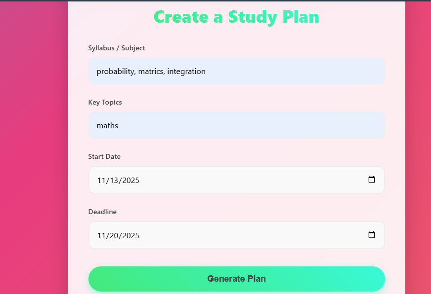

# 🎓 Smart Study Scheduler Tools

An AI-powered web application that integrates four NLP tools — question generation, text summarization, question answering, and study plan generation — into a single unified platform for students.

> Built as a Minor Project | B.Tech CSE | Gurukul Kangri University | Nov 2025

---

## 🚀 Features

| Feature | Model Used | What It Does |
|---|---|---|
| **Question Generator** | `valhalla/t5-base-qg-hl` | Generates practice questions from any input text |
| **Text Summarizer** | `facebook/bart-large-cnn` | Condenses long paragraphs into concise summaries |
| **Question Answering** | `distilbert-base-uncased-distilled-squad` | Extracts precise answers from a given context |
| **Study Plan Generator** | `Google Gemini Pro API` | Creates a structured, day-by-day study schedule from your syllabus and deadlines |

---

## 🖥️ Screenshots

### Home Page


### Question Generator


### Text Summarizer


### Study Plan Generator


---

## 🛠️ Tech Stack

- **Backend:** Python, Flask
- **AI/ML:** Hugging Face Transformers (T5, BART, DistilBERT)
- **External API:** Google Generative AI (Gemini Pro)
- **Frontend:** HTML, CSS
- **Environment:** CPU-compatible (no GPU required)

---

## 📁 Project Structure

```
smart-study-scheduler/
│
├── app.py              # Main Flask application — all routes and logic
├── config.py           # API key configuration (Gemini API)
├── requirements.txt    # All dependencies
│
└── templates/
    ├── index.html              # Home page
    ├── question-generator.html
    ├── summarizer.html
    ├── qa.html
    └── study-plan.html
```

---

## ⚙️ Installation & Setup

### 1. Clone the repository
```bash
git clone https://github.com/devanshkumar7505-byte/smart-study-scheduler.git
cd smart-study-scheduler
```

### 2. Create and activate a virtual environment
```bash
python -m venv venv

# Windows
venv\Scripts\activate

# macOS/Linux
source venv/bin/activate
```

### 3. Install dependencies
```bash
pip install -r requirements.txt
```

> **Note:** This project uses CPU-only PyTorch. If the install fails, run:
> ```bash
> pip install torch --index-url https://download.pytorch.org/whl/cpu
> ```

### 4. Configure your Gemini API key
Open `config.py` and add your key:
```python
GEMINI_API_KEY = "your_api_key_here"
```
Get a free key at: https://makersuite.google.com/app/apikey

### 5. Run the application
```bash
python app.py
```
Open your browser and go to: `http://127.0.0.1:5000`

---

## 🔗 API Routes

| Route | Method | Description |
|---|---|---|
| `/` | GET | Home page |
| `/question-generator` | GET, POST | Generate questions from text |
| `/summarizer` | GET, POST | Summarize long text |
| `/answer-question` | GET, POST | Answer a question from context |
| `/study-plan` | GET, POST | Generate a study plan |

---

## 💡 How It Works

1. User inputs text (or syllabus details) via a simple web form
2. Browser sends a POST request to the relevant Flask route
3. Flask triggers the appropriate AI model or API call
4. The result is rendered back to the user on a new page

Each feature runs independently — swap the model, same request-response flow.

---

## ⚠️ Known Limitations

- **Question Generator** works best with factual, structured paragraphs; quality may vary on informal text
- **Question Answering** is extractive — it can only find answers explicitly present in the provided context
- **All models run on CPU** — response time may be slower on low-spec machines (30–60 seconds for summarization)
- Gemini API requires an active internet connection and a valid API key

---

## 🔮 Future Improvements

- [ ] Integrate GPT-4 for more accurate question generation
- [ ] Add voice input/output support
- [ ] Deploy as a cloud-based SaaS application (Render / Hugging Face Spaces)
- [ ] Allow users to upload PDF files directly
- [ ] Add highlight-to-question feature for answer-aware question generation

---

## 👨‍💻 Author

**Devansh Kumar**
- 📧 devansh.kumar7983@gmail.com
- 💼 [LinkedIn](https://linkedin.com/in/devansh7505)
- 🐙 [GitHub](https://github.com/devanshkumar7505-byte)

---

## 📄 License

This project is open source and available under the [MIT License](LICENSE).
